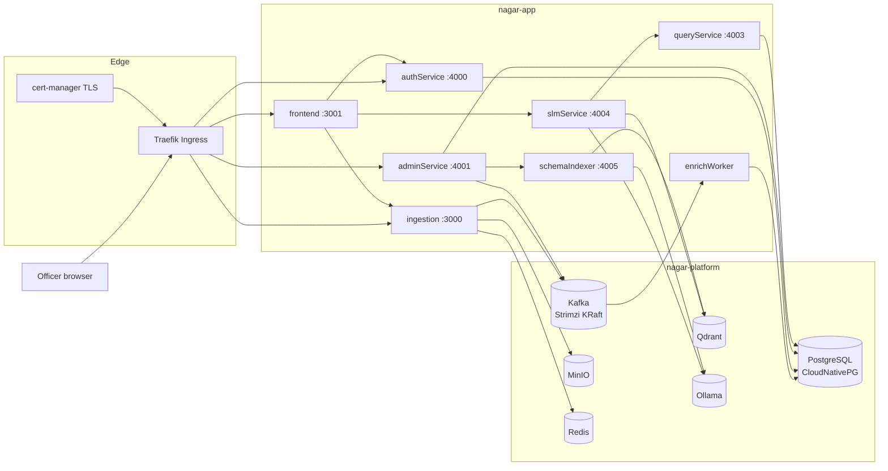
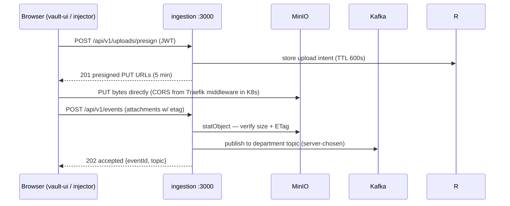
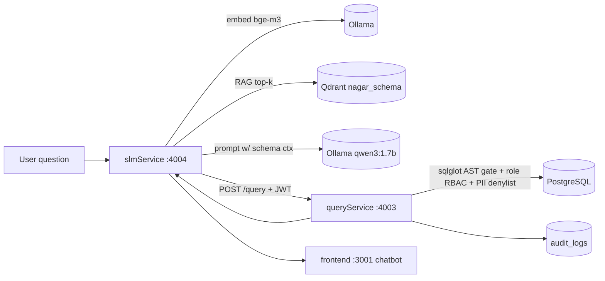

# Architecture — NagarVault

> Companion to [AGENTS.md](../AGENTS.md). Describes the system **as designed** (the Kubernetes
> target state) and **as it exists today** (the frozen Compose runtime) — clearly labeled, never
> conflated. Current world state: [PHASES.md](PHASES.md) §0.

---

## 1. Namespace topology (target state)

| Namespace | Contains | Phase |
|---|---|---|
| `nagar-platform` | PostgreSQL (CNPG), Kafka (Strimzi), MinIO, Redis, Qdrant, Ollama, init Jobs | 3–6 |
| `nagar-app` | All application services and UIs | 7 |
| `nagar-observability` | Prometheus stack, Loki, Grafana | 9 |
| `nagar-system` | Argo CD, Sealed Secrets controller, Kyverno, cert-manager support | 1–2 |
| `cert-manager` | cert-manager itself | 1 |

Cross-namespace traffic is default-deny and opened by named NetworkPolicies only (SECURITY §8).

> **Phase 1 note (2026-09-29):** the Kyverno controllers run in their upstream-native `kyverno`
> namespace instead of `nagar-system` — the static bundle hardcodes its namespace and admission
> webhook wiring (see `deploy/third_party/README.md` and the mission log). All other placements
> follow this table.

## 2. High-level topology (target state)



## 3. Core flows

### 3.1 Authentication (implemented in code today; carried forward unchanged)

1. `POST /login` (authService :4000) verifies credentials against `users` (argon2id hashes) and
   returns a JWT signed with the shared `JWT_SECRET`. Claims required at validation time:
   `iss=nagar-auth`, `aud=nagar-services`, `jti`, `sub`, `role`, `exp` (60-minute TTL).
   The token is set as an `httponly` `session_token` cookie (`samesite=lax`; `secure` when
   `COOKIE_SECURE=true`).
2. Downstream services (`queryService`, `slmService`, ingestion) decode with the same secret and
   claims; `enrichWorker` and `schemaIndexer` require no user JWT (they are internal workers).
3. `POST /logout` revokes server-side (jti denylist row) and clears the cookie.
4. Login is rate-limited to 5 req/min per IP. First admin is seeded out-of-band via
   `seed_admin.py` (OPERATIONS §5); subsequent users are created by an admin via `POST /create`.

### 3.2 Media ingestion (presigned, direct-to-object-store)



Invariant: **the API never proxies media bytes.** Kafka receives durable `bucket`/`objectKey`
references only. Topic routing is server-side; clients cannot choose topics. Duplicates are
detected via `sourceSystem + sourceRecordId` and answered `200 duplicate` idempotently.

Presigned URLs are minted for the browser on the public edge origin under the frozen `/minio`
route (`PRESIGN_PUBLIC_URL`; ADR-025). The signature is bound to the edge hostname and the edge
strips the route prefix before MinIO verifies it, so the browser PUTs the returned URL verbatim;
the API's own read paths (`statObject`, health) keep using the in-cluster `MINIO_URL`.

### 3.3 Enrichment (Kafka → PostgreSQL)

`enrichWorker` consumes the five raw topics plus the DLQ, normalizes payloads per department, and
upserts into `nmc_complaints`, `traffic_events`, `water_sensor_readings`, `health_camp_records`,
`ev_bus_telemetry` (schema in `deploy/phases/05-postgres/migrations/001_create_tables.sql`,
idempotent `IF NOT EXISTS`, applied by that phase's migration Job; the path was corrected from
`enrichWorker/migrations/` in Phase 5 — see ADR-019 §9). Malformed events go to `nmc.complaints.dlq.v1` for inspection via adminService.

### 3.4 Natural-language query (NL → SQL)



Guardrails in the path (all implemented today): SELECT-only AST validation, per-role table RBAC
(`health_camp_records` requires `ROLE_HEALTH_OFFICER`), PII column denylist
(`name, phone, email, address, aadhaar`), full audit of every executed or blocked query to
`audit_logs`, `temperature=0` generation with `"think": false`.

## 4. Component contracts

### 4.1 HTTP endpoint registry (verified against source, 2026-09-29)

| Service | Method | Path | Auth | Purpose |
|---|---|---|---|---|
| authService :4000 | POST | `/login` | public (rate-limited) | issue session cookie |
| authService | GET | `/whoami` | cookie/JWT | identity echo |
| authService | GET | `/dbcheck` | public | DB liveness |
| authService | POST | `/create` | admin JWT | create user |
| authService | POST | `/logout` | cookie | revoke session |
| authService | GET | `/` | public | liveness |
| adminService :4001 | GET | `/health/cluster` | admin JWT | infra health summary |
| adminService | GET | `/audit-logs` | admin JWT | query audit trail |
| adminService | POST | `/vector/resync` | admin JWT | trigger schemaIndexer reindex |
| adminService | GET | `/dlq` | admin JWT | inspect DLQ messages |
| adminService | GET | `/traces/slow-queries` | admin JWT | slow query traces |
| ingestion :3000 | POST | `/api/v1/uploads/presign` | JWT | mint presigned PUTs |
| ingestion | GET | `/api/v1/uploads/:attachmentId` | JWT | intent status |
| ingestion | POST | `/api/v1/events` | JWT | commit event (202/200-dup) |
| ingestion | GET | `/api/v1/events/:eventId` | JWT | event status |
| ingestion | GET | `/health` | public | health (API/MinIO/Kafka) |
| queryService :4003 | POST | `/query` | JWT + role RBAC | execute validated SQL |
| slmService :4004 | GET | `/health` | public | ollama/qdrant/query status |
| slmService | POST | `/ask` | JWT | NL question → SQL + rows |
| schemaIndexer :4005 | POST | `/reindex` | internal | rebuild Qdrant collection |

### 4.2 Kafka topic registry (frozen names)

| Topic | Producer | Consumer | Payload |
|---|---|---|---|
| `health.camps.raw.v1` | ingestion | enrichWorker | health camp events |
| `nmc.complaints.raw.restricted.v1` | ingestion | enrichWorker | citizen complaints (restricted) |
| `traffic.events.raw.v1` | ingestion | enrichWorker | traffic events |
| `water.sensors.raw.v1` | ingestion | enrichWorker | water sensor readings |
| `ev.bus.telemetry.raw.v1` | ingestion | enrichWorker | EV bus telemetry |
| `nmc.complaints.dlq.v1` | enrichWorker | adminService (inspect) | malformed complaint events |

Creation is idempotent (`--if-not-exists`) via a Job (exemplar: [manifests/exemplars/kafka-topics-job.yaml](manifests/exemplars/kafka-topics-job.yaml)).

### 4.3 Storage registry

| Store | Databases / buckets / collections | Notes |
|---|---|---|
| PostgreSQL | `nagardb` (+ `users`, `sessions`, 5 dept tables, `audit_logs`) | owned by CloudNativePG; tables by idempotent migration Job |
| MinIO | `raw-media`, `raw-sensitive-media`, `pg-backups` | buckets via idempotent init Job (`deploy/phases/03-object-cache/bucket-init-job.yaml`, matching `docs/manifests/exemplars/minio-statefulset.yaml` and the MISSION.md §3 gate; `pg-backups` is CNPG's backup target, OPERATIONS §7); CORS handled at edge in K8s (no per-origin bucket config) |
| Redis | `upload-intent:*`, `event:id:*`, `event:src:*` | TTL-based; no persistence required |
| Qdrant | collection `nagar_schema` | rebuilt by schemaIndexer; 40 chunks from `schema_docs.json` |
| Ollama | models `bge-m3`, `qwen3:1.7b` | provisioned by checksum-pinned model Job onto PVC |

### 4.4 Dependency graph (startup order — target state)

```
Tier 0: namespaces, secrets (SealedSecrets), Kyverno/PSS, cert-manager
Tier 1: MinIO, Redis  (independent of each other)
Tier 2: Kafka (needs nothing from Tier 1)  |  PostgreSQL (CNPG)
Tier 3: init Jobs — topics, buckets, migrations (each targets one Tier-2 system)
Tier 4: Ollama (+model Job)  |  Qdrant
Tier 5: schemaIndexer, enrichWorker (need Tier 3 outputs)
Tier 6: authService, queryService (need PostgreSQL)
Tier 7: slmService (needs Ollama+Qdrant+queryService), ingestion (needs MinIO+Redis+Kafka)
Tier 8: adminService (needs PostgreSQL+Kafka+schemaIndexer)
Tier 9: frontend, vault-ui (need Tier 7 endpoints)
```

App manifests express these as plain Kubernetes ordering (init probes/readiness, not hard
`depends_on` chains), so any component can crash-loop independently without freezing the deploy.

## 5. Security architecture

Summarized here; normative text in [SECURITY.md](SECURITY.md).

- **Identity:** one JWT chain, `iss=nagar-auth`, `aud=nagar-services`, 60-min TTL, jti denylist.
- **AuthZ:** role claims enforced twice — in queryService RBAC and (defense-in-depth) Postgres grants.
- **Network:** default-deny all east-west and ingress; explicit allows per flow above.
- **Pod security:** PSS `restricted` (non-root, seccomp RuntimeDefault, drop ALL caps) via Kyverno.
- **Data:** PII never leaves Postgres; embeddings contain schema docs only; media stays in MinIO.

## 6. What changes from Compose to Kubernetes (delta summary)

| Concern | Compose (today, frozen) | Kubernetes (target) |
|---|---|---|
| Model pull | manual `ollama pull` / init sidecar | checksum-pinned model Job onto PVC, self-healing on re-apply |
| Init ordering | `depends_on: service_completed_successfully` | readiness probes + init Jobs with backoff |
| CORS | MinIO env + `cors.xml` per origin | Traefik middleware allowlist (single source) |
| TLS | plain HTTP | cert-manager internal-CA certs at the edge |
| Secrets | root `.env` file | SealedSecrets in git |
| Health-gating | compose conditions | probes + PDBs + `maxUnavailable` |
| Backups | none | CNPG scheduled WAL + base backups to MinIO |

No application-level behavior changes. The delta is purely operational.
